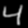

# GPU-Accelerated MNIST Edge Pipeline with CUDA NPP

This project uses NVIDIA CUDA and the NPP library to process a large batch of MNIST handwritten digit images on the GPU. The application loads thousands of small grayscale images, applies Gaussian smoothing with NPP, computes Sobel gradients with NPP, and then launches a custom CUDA kernel to calculate edge magnitude and per-image statistics.

The goal was to demonstrate practical GPU-based image processing on a dataset large enough to meet the assignment requirements.

---

## Use case

A practical use case is OCR and document preprocessing at scale. Before handwritten characters are classified or fed into a recognition pipeline, it is common to denoise, smooth, and extract edges. This project demonstrates that workflow on the MNIST dataset.

The pipeline is:

1. Read MNIST images from the original `.gz` IDX file  
2. Transfer images to GPU memory  
3. Use CUDA NPP to apply:  
   - Gaussian blur  
   - Sobel horizontal gradient  
   - Sobel vertical gradient  
4. Use a custom CUDA kernel to:
   - compute edge magnitude  
   - calculate per-image statistics  
5. Write results to disk:
   - CSV statistics  
   - logs  
   - sample processed images  

---

## What this project demonstrates

- GPU-accelerated image processing using CUDA  
- Use of NVIDIA NPP (high-performance GPU library)  
- Custom CUDA kernel for post-processing  
- Batch processing of thousands of small images  
- End-to-end pipeline from input data → GPU → output artifacts  

---

## Dataset

This project uses the MNIST handwritten digit dataset.

- 70,000 grayscale images  
- Each image is 28×28 pixels  
- Data is stored in compressed IDX format (`.gz`)  

The program processes thousands of images in a single execution (e.g., 5000 images).

Dataset is downloaded using:

    bash scripts/download_mnist.sh

---

## GPU processing details

This project uses both:

### CUDA NPP (library)
- Gaussian filtering  
- Sobel edge detection  

### Custom CUDA kernel
- Combines Sobel X and Y gradients  
- Computes edge magnitude  
- Calculates statistics per image  

---

## Repository layout

.
├── Makefile  
├── README.md  
├── run.sh  
├── scripts/download_mnist.sh  
├── src/main.cu  
├── data  
└── output (generated)  

---

## System Prerequisites

This project was developed and tested on the following setup:

### Hardware
- NVIDIA GPU (Tested on RTX 4070 Laptop GPU)

### Operating System
- Windows 11 with WSL2 (Ubuntu 22.04)

### Software Requirements

#### NVIDIA Drivers
Install latest NVIDIA drivers (Windows side)

Verify:
```
nvidia-smi
```

#### CUDA Toolkit (inside WSL)
Install CUDA Toolkit for Linux (inside Ubuntu)

Verify:
```
nvcc --version
```

#### Build Tools
```
sudo apt update
sudo apt install -y build-essential make
```

#### Required Libraries
```
sudo apt install -y zlib1g-dev
```

---

## Quick Setup Script

You can run the following commands to set up everything:

```
# Update system
sudo apt update

# Install build tools
sudo apt install -y build-essential make

# Install zlib
sudo apt install -y zlib1g-dev

# Set CUDA paths (if not already set)
export PATH=/usr/local/cuda/bin:$PATH
export LD_LIBRARY_PATH=/usr/local/cuda/lib64:$LD_LIBRARY_PATH
```

---

## Run the Project

```
# Download dataset
bash scripts/download_mnist.sh

# Build
make

# Run
bash run.sh

# Manual run
./mnist_npp --images data/train-images-idx3-ubyte.gz --count 5000 --output-dir output
```

---

## Example run

    Loaded 5000 images of size 28x28
    Processing complete.
    Artifacts written to: output

---

## Output artifacts

After running, the output/ directory contains:

- image_stats.csv  
- run_log.txt  
- execution.log  
- sample_*_input.pgm  
- sample_*_blur.pgm  
- sample_*_edge.pgm  

---

## Proof of code execution

- CSV output - https://github.com/ebenezermamidi-bsu/CUDAAtScale_NPP_MNIST_Processing/blob/main/output/image_stats.csv
- logs
   - Execution https://github.com/ebenezermamidi-bsu/CUDAAtScale_NPP_MNIST_Processing/blob/main/output/execution.log
   - Run https://github.com/ebenezermamidi-bsu/CUDAAtScale_NPP_MNIST_Processing/blob/main/output/run_log.txt
- sample images

   | Input | Blur | Edge |
   |------|------|------|
   |  |  |  |
   |  |  |  |
   |  |  |  |
   |  |  |  |
   |  |  |  |
   |  |  |  |
   |  |  |  |
   |  |  |  |    
- terminal window and output directory screenshot
  
  

